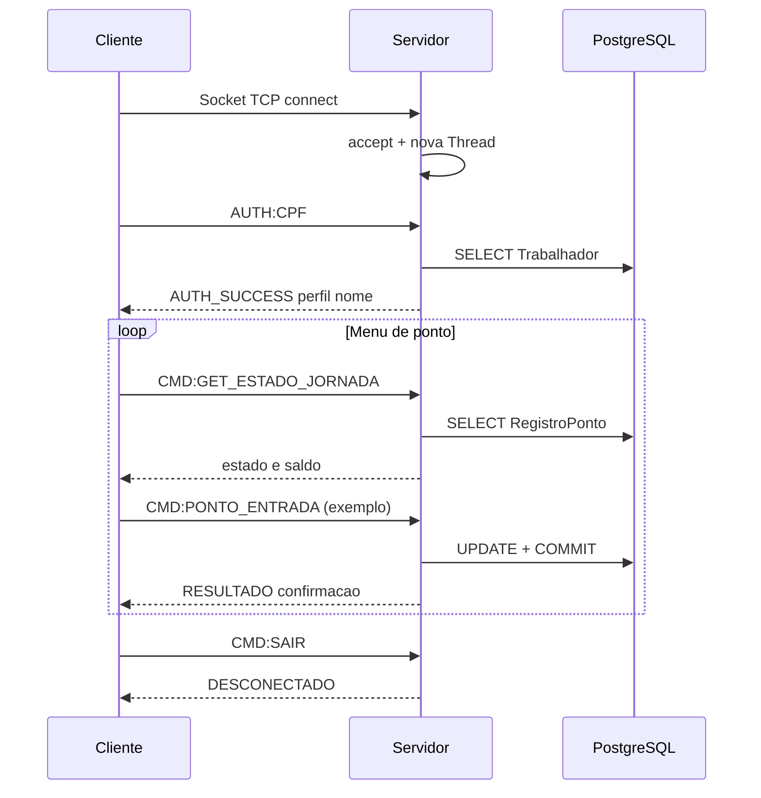

# Gestão de Frequências — Canteiro de Obras

**Disciplina:** AD44S — Aplicações Distribuídas e Concorrentes  
**Acadêmico:** Matheus C. P. Santos — RA 2609380  
**UTFPR** Campus Pato Branco — Trabalho III (Sockets TCP)

Sistema distribuído de **gestão de frequência em canteiros de obras** (ODS 8). O **servidor central** concentra o PostgreSQL; os **terminais remotos** registram ponto via **TCP**.

## Arquitetura

```
┌─────────────────────────────┐      TCP :8080       ┌──────────────────────────────┐
│  TerminalCanteiroClienteTCP │ ◄──────────────────► │     ServidorCentralTCP       │
│       (Nodo 2 — canteiro)   │                      │    (Nodo 1 — servidor)       │
└─────────────────────────────┘                      └──────────────┬───────────────┘
                                                                    ▼
                                                       PostgreSQL (trabalho_decente)
```

| Nodo | Papel |
|------|-------|
| Servidor | Autenticação, registro de ponto, persistência, gestão remota |
| Terminal | Interface de ponto no canteiro; admin acessa painel completo (opção 7) |

**Stack:** Java 21 · Sockets TCP · JPA/Hibernate · PostgreSQL · Maven

## Por que TCP?

Dados de RH (ponto, jornada, autenticação) exigem **entrega garantida e ordem correta** — o que o TCP oferece e o UDP não.

- **Sessão persistente** — após `AUTH:CPF`, comandos `CMD:` trafegam na mesma conexão
- **Diálogo confiável** — cada ação envia comando e aguarda resposta (`RESULTADO`, `FIM_FICHA`)
- **Concorrência** — uma thread por conexão (`accept()` + `new Thread`)
- **Gestão remota** — menu administrativo troca dezenas de linhas pelo mesmo socket

UDP seria adequado para telemetria descartável (ex.: sensor de temperatura); não para folha de ponto.

## Classes principais

| Classe | Função |
|--------|--------|
| `ServidorCentralTCP` | Escuta porta 8080, processa comandos, grava no banco |
| `TerminalCanteiroClienteTCP` | Cliente — conecta, autentica e exibe menu de ponto |
| `NetworkConfig` | IP, porta, UTF-8 e listagem de IPs locais do servidor |
| `GestaoRemotaSession` | Painel admin roda no servidor, interface no terminal |
| `PopularBancoDados` | Popula dados de demonstração |

## Threads

O projeto usa threads em três situações distintas:

| Onde | Para quê |
|------|----------|
| `ServidorCentralTCP` | Uma thread por conexão TCP — vários terminais atendidos em paralelo |
| `GestaoRemotaSession` | Thread auxiliar lê saída do servidor enquanto o usuário digita no cliente |
| `ProcessadorFolhaPagamento` | Cálculo paralelo da folha (menu admin → Análise de Desempenho) |

No servidor, cada `accept()` dispara `new Thread(() -> processarRequisicao(...))`. O acesso ao banco é protegido com `synchronized` em `JPAUtil`, já que múltiplas threads compartilham o `EntityManagerFactory`.

## Como executar

```text
1. PopularBancoDados          # primeira vez
2. ServidorCentralTCP         # PC servidor (anote o IP exibido)
3. TerminalCanteiroClienteTCP 192.168.x.x 8080   # PC do canteiro
```

> Use o IP da rede local (não `127.0.0.1`) entre PCs diferentes. Libere a porta **8080** no firewall.

| Perfil | CPF | Destaque |
|--------|-----|----------|
| Administrador | `11111111111` | Opção 7 — Painel de Gestão |
| CLT | `22222222222` | Registro de ponto |
| Estagiário | `44444444444` | Registro de ponto |

## Fluxo da comunicação



### Passo a passo resumido

| # | Etapa | Onde acontece |
|---|-------|---------------|
| 1 | Servidor abre `ServerSocket:8080`, lista IPs locais e aguarda em `accept()` | `ServidorCentralTCP` |
| 2 | Cliente abre `Socket`, cria streams UTF-8 | `TerminalCanteiroClienteTCP` |
| 3 | Cliente envia `AUTH:CPF` → servidor valida no banco | ambos |
| 4 | Loop: `CMD:GET_ESTADO_JORNADA` → menu adaptado ao estado da jornada | ambos |
| 5 | Usuário escolhe opção → `CMD:PONTO_*` → servidor grava e responde | `ServidorCentralTCP` + JPA |
| 6 | Opção 6 → `CMD:SAIR` → conexão encerra | ambos |

### Protocolo (uma linha por mensagem)

| Mensagem | Exemplo |
|----------|---------|
| Autenticação | `AUTH:22222222222` |
| Comando | `CMD:PONTO_ENTRADA` |
| Resposta OK | `AUTH_SUCCESS;OPERACIONAL;João...` |
| Resposta ponto | `RESULTADO;Entrada registrada as 08:00` |

## Trechos-chave do código

**Servidor — concorrência** (`ServidorCentralTCP.java`):

```java
while (true) {
    Socket clientSocket = serverSocket.accept();
    new Thread(() -> processarRequisicao(clientSocket)).start();
}
```

**Cliente — conexão e login** (`TerminalCanteiroClienteTCP.java`):

```java
Socket socket = new Socket(ipServidor, portaServidor);
out.println("AUTH:" + cpf);
String respostaAuth = in.readLine();
```

**Servidor — roteamento de mensagens** (`ServidorCentralTCP.java`):

```java
while ((mensagem = in.readLine()) != null) {
    if (mensagem.startsWith("AUTH:")) { /* valida CPF */ }
    else if (mensagem.startsWith("CMD:") && cpfAutenticado != null) { /* executa */ }
}
```

**Descoberta de IP** (`NetworkConfig.listarIpsLocais`) — percorre interfaces de rede ativas, ignora loopback, retorna IPv4 (ex.: `192.168.1.10`) para o operador informar no terminal remoto.

**Gestão remota** — admin escolhe opção 7; `MenuConsoleSimplificado` executa no servidor com `System.out` redirecionado ao socket; banco acessado só em `localhost`.

---

*UTFPR — Campus Pato Branco — AD44S — 2026*
