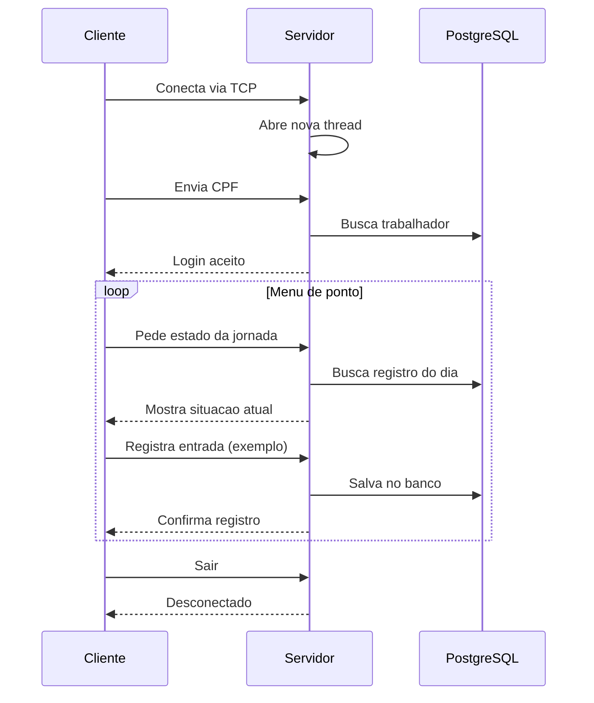
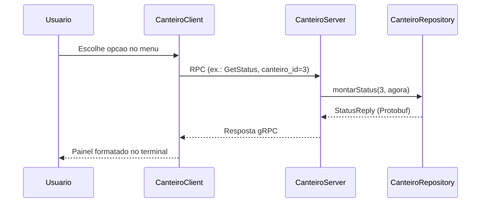

# Gestão de Canteiro de Obras — AD44S

**Disciplina:** AD44S — Aplicações Distribuídas e Concorrentes  
**Acadêmico:** Matheus C. P. Santos — RA 2609380  
**UTFPR** Campus Pato Branco

Este repositório reúne **três frentes** do trabalho:

1. **Folha salarial em threads** — benchmark de processamento paralelo  
2. **Gestão de frequências** — sistema principal com Sockets TCP e PostgreSQL  
3. **Monitor gRPC** — painel corporativo complementar dos canteiros

---

# Folha Salarial em Threads

Módulo de **análise de desempenho computacional** que simula o cálculo da folha de pagamento anual de centenas de milhares de empregados, comparando execução **serial** e **paralela** com múltiplas threads.

## Sobre o problema

Cada registro representa um empregado com salário base. O processador calcula o **líquido anual** (12 meses) aplicando regras simplificadas:

- Variação sazonal do salário  
- Faltas (0 a 3 por mês) com desconto proporcional  
- Afastamentos, hora extra e feriado trabalhado  
- INSS, IRRF, FGTS e termo de periculosidade  
- 13º simplificado em dezembro  
- Demissão/rescisão com encerramento dos meses seguintes  

Os sorteios são **determinísticos** (por ID do empregado e mês), permitindo reproduzir o mesmo cenário em execuções diferentes.

## Threads

| Modo | Implementação |
|------|----------------|
| Serial | Um único fluxo percorre todos os registros |
| Paralelo (2 threads) | Metade dos registros em cada thread |
| Paralelo (N threads) | Partição em lotes com `Thread` + `join()` |

O benchmark mede **tempo**, **speed-up** e **eficiência** de 1 até 16 threads (modo completo) e exporta resultados para terminal ou Excel.

## Principais classes

| Classe | Função |
|--------|--------|
| `ProcessadorFolhaPagamento` | Cálculo da folha, execução serial e paralela |
| `MenuConsoleSimplificado` | Opção 7 — Análise de Desempenho (Threads) |
| `ExportadorBenchmark` | Exportação dos resultados para planilha |

## Como rodar

Pelo menu administrativo local (`MenuConsoleSimplificado`):

```text
Opção 7 — Análise de Desempenho (Threads)
```

Modos disponíveis:

| Modo | Registros | Threads máx. | Uso |
|------|-----------|--------------|-----|
| Completo | 300.000.000 | 16 | Relatório / avaliação |
| Apresentação rápida | carga reduzida | 8 | Demonstração em sala |

> A carga completa exige bastante memória RAM e tempo de processamento. Use o modo rápido para testes.

---

# Gestão de Frequências — Canteiro de Obras

**Trabalho III — Sockets TCP**

## 1. Sobre o projeto

Sistema para **controlar a frequência dos trabalhadores em canteiros de obras**, alinhado ao ODS 8 (Trabalho Decente).

- **Servidor central** — concentra o banco PostgreSQL e processa tudo
- **Terminais nos canteiros** — interface para bater ponto pela rede
- **Comunicação** — Sockets TCP na porta 8080

---

## 2. Arquitetura

```
┌─────────────────────────────┐      TCP :8080       ┌──────────────────────────────┐
│  TerminalCanteiroClienteTCP │ ◄──────────────────► │     ServidorCentralTCP       │
│   (computador do canteiro)  │                      │   (computador do servidor)   │
└─────────────────────────────┘                      └──────────────┬───────────────┘
                                                                    ▼
                                                       PostgreSQL (trabalho_decente)
```

| Computador | Papel |
|------------|-------|
| Servidor central | Valida CPF, registra ponto, salva no banco, painel de gestão |
| Terminal do canteiro | Tela de ponto; admin acessa menu completo (opção 7) |

**Quem conecta em quem?**

O trabalhador usa o **PC do canteiro** (cliente), digita o CPF e escolhe as opções. Esse terminal **se conecta ao servidor central** — não o contrário.

```
Trabalhador → PC do canteiro → TCP → Servidor central → PostgreSQL
```

**Tecnologias:** Java 21 · Sockets TCP · JPA/Hibernate · PostgreSQL · Maven

---

## 3. Por que TCP?

O registro de ponto precisa **chegar inteiro e na ordem certa**. TCP garante isso; UDP não.

- Cliente e servidor ficam **conectados** durante toda a sessão
- Cada ação envia um **pedido e espera resposta** (`RESULTADO`, `FIM_FICHA`)
- Vários terminais usam o sistema **ao mesmo tempo** (uma thread por conexão)
- UDP serviria para dados que podem se perder (ex.: sensor); **não para folha de ponto**

---

## 4. Principais classes

| Classe | O que faz |
|--------|-----------|
| `ServidorCentralTCP` | Escuta na porta 8080, processa comandos, grava no banco |
| `TerminalCanteiroClienteTCP` | Conecta ao servidor, faz login e exibe o menu |
| `NetworkConfig` | IP, porta e listagem dos IPs do servidor |
| `GestaoRemotaSession` | Painel admin no canteiro, processamento no servidor |
| `PopularBancoDados` | Cria dados de demonstração |

---

## 5. Threads

Cada **terminal conectado** ganha uma **thread** no servidor.

| Onde | Para quê |
|------|----------|
| `ServidorCentralTCP` | Uma thread por conexão TCP — terminais em paralelo |
| `GestaoRemotaSession` | Thread lê saída do servidor enquanto o usuário digita |

**Regra:** thread = conexão do terminal. Se cada canteiro tem 1 PC ligado, cada canteiro usa 1 thread.

**Exemplo — 3 funcionários, 3 PCs, mesmo canteiro:**

```
ServidorCentralTCP
├── Thread 1 → João  (CPF 22222222222)
├── Thread 2 → Lucas (CPF 44444444444)
└── Thread 3 → Maria (outro CPF)
```

Cada um faz login e bate ponto **em paralelo**, sem misturar registros. No **mesmo PC**, um usa por vez — sai (opção 6), o próximo conecta.

**No banco:** o `JPAUtil` usa `synchronized` para evitar conflito quando várias threads gravam juntas.

> Para o benchmark de folha salarial com múltiplas threads, veja a seção **Folha Salarial em Threads** no início deste documento.

---

## 6. Demonstração — como rodar

```text
1. PopularBancoDados          # primeira vez
2. ServidorCentralTCP         # PC servidor — anote o IP exibido
3. TerminalCanteiroClienteTCP 192.168.x.x 8080   # PC do canteiro
```

> Use IP da rede local (`192.168.x.x`), não `127.0.0.1`, entre PCs diferentes. Libere a porta **8080** no firewall.

| Perfil | CPF | Observação |
|--------|-----|------------|
| Administrador | `11111111111` | Opção 7 — Painel de Gestão |
| CLT | `22222222222` | Registro de ponto |
| Estagiário | `44444444444` | Registro de ponto |

---

## 7. Fluxo da comunicação



| # | Etapa |
|---|-------|
| 1 | Servidor liga na porta 8080 e aguarda conexão |
| 2 | Terminal conecta → servidor abre uma thread |
| 3 | Terminal envia CPF → servidor valida no banco |
| 4 | Terminal pede estado → servidor monta o menu |
| 5 | Trabalhador escolhe opção → servidor grava e confirma |
| 6 | Opção Sair → conexão encerra |

### Mensagens (uma linha por vez)

| Tipo | Exemplo |
|------|---------|
| Login | `AUTH:22222222222` |
| Comando | `CMD:PONTO_ENTRADA` |
| Login OK | `AUTH_SUCCESS;OPERACIONAL;João...` |
| Confirmação | `RESULTADO;Entrada registrada as 08:00` |

---

## 8. Código principal — Sockets TCP

A comunicação usa as classes `ServerSocket` e `Socket` do Java. O TCP abre um **canal persistente**: cliente e servidor trocam mensagens com `PrintWriter` (saída) e `BufferedReader` (entrada) ligados aos streams do socket.

**Servidor — `ServerSocket` escuta e `accept()` aceita a conexão TCP** (`ServidorCentralTCP.java`):

```java
// ServerSocket fica escutando a porta 8080 aguardando conexões TCP
try (ServerSocket serverSocket = new ServerSocket(porta)) {
    while (true) {
        // accept() bloqueia até um cliente conectar — retorna o Socket da sessão
        Socket clientSocket = serverSocket.accept();

        // Cada Socket TCP ganha uma thread — concorrência entre terminais
        new Thread(() -> processarRequisicao(clientSocket)).start();
    }
}
```

**Terminal — `Socket` conecta ao servidor e abre os streams TCP** (`TerminalCanteiroClienteTCP.java`):

```java
// Socket(ip, porta) inicia o handshake TCP com o servidor central
try (
    Socket socket = new Socket(ipServidor, portaServidor);
    PrintWriter out = NetworkConfig.escritor(socket);   // saída → socket.getOutputStream()
    BufferedReader in = NetworkConfig.leitor(socket)    // entrada ← socket.getInputStream()
) {
    // Envia uma linha pelo canal TCP (println adiciona \n no fim da mensagem)
    out.println("AUTH:" + cpf);

    // Bloqueia até o servidor responder pela mesma conexão TCP
    String respostaAuth = in.readLine();
}
```

**Servidor — leitura e escrita pelo canal TCP** (`ServidorCentralTCP.java`):

```java
// Streams criados a partir do Socket aceito — canal aberto com aquele terminal
BufferedReader in = NetworkConfig.leitor(clientSocket);
PrintWriter out = NetworkConfig.escritor(clientSocket);

// Lê linhas do socket enquanto a conexão TCP estiver ativa
while ((mensagem = in.readLine()) != null) {
    if (mensagem.startsWith("AUTH:")) {
        // Responde pelo mesmo socket TCP
        out.println("AUTH_SUCCESS;OPERACIONAL;" + nome);
    }
    else if (mensagem.startsWith("CMD:") && cpfAutenticado != null) {
        // Processa comando e devolve resultado pela conexão
        out.println("RESULTADO;Entrada registrada as 08:00");
    }
}
```

**IP do servidor** — `NetworkConfig.listarIpsLocais()` mostra o IP do PC (ex.: `192.168.1.10`) para o terminal saber onde abrir o `Socket`.

**Gestão remota (opção 7)** — o menu admin reutiliza o **mesmo Socket TCP**; saída e entrada trafegam pelo canal já aberto.

---

# Monitor corporativo — `monitor-grpc`

Módulo complementar ao sistema de ponto. Expõe um **painel corporativo** via **gRPC na porta 50052** para acompanhar a operação das obras — equipe, estoque, finanças e compras. Útil para engenheiros e gestores que precisam de visão ampla do canteiro, sem depender do fluxo de registro de ponto dos trabalhadores.

## 1. Sobre o módulo

Enquanto o sistema TCP cuida do **ponto individual** (entrada, saída, ficha do dia), o monitor gRPC responde perguntas de **gestão**:

- O canteiro está aberto agora? Quantos pedreiros estão no local?
- Quais engenheiros estão presentes em cada obra?
- Algum material está com estoque crítico?
- A obra está dentro do orçamento?
- Há compras pendentes de aprovação?

Os dados são **simulados em memória** (`CanteiroRepository`) — cinco canteiros de exemplo com equipe, materiais, finanças e pedidos de compra. Não há integração com o PostgreSQL do sistema principal; o objetivo é demonstrar **comunicação gRPC** com contrato tipado (`.proto`).

**Tecnologias:** Java 8 · gRPC 1.81 · Protocol Buffers 3.25 · Gradle · Netty (transporte)

---

## 2. Arquitetura

```
┌─────────────────────┐      gRPC :50052      ┌─────────────────────┐
│   CanteiroClient    │ ◄──────────────────► │   CanteiroServer    │
│  (painel consulta)  │   HTTP/2 + Protobuf   │  (dados em memoria) │
└──────────┬──────────┘                      └──────────┬──────────┘
           │                                            │
    CanteiroMenu.java                          CanteiroServiceImpl
    (menus no terminal)                        (6 RPCs → Repository)
```

| Canal | Porta | Build | Papel |
|-------|-------|-------|-------|
| TCP (Maven) | 8080 | `pom.xml` | Ponto dos trabalhadores → PostgreSQL |
| gRPC (Gradle) | 50052 | `monitor-grpc/` | Monitoramento corporativo → memória |

**Quem conecta em quem?**

O **cliente** (`CanteiroClient`) abre o canal gRPC e chama os RPCs sob demanda. O **servidor** (`CanteiroServer`) fica escutando na porta 50052 e responde cada consulta com mensagens Protobuf — não há sessão contínua como no TCP de ponto.

```
Gestor → CanteiroClient → gRPC → CanteiroServer → CanteiroRepository (memória)
```

---

## 3. Por que gRPC?

| Aspecto | TCP (ponto) | gRPC (monitor) |
|---------|-------------|----------------|
| Formato | Texto linha a linha (`AUTH:`, `CMD:`) | Mensagens binárias tipadas (`.proto`) |
| Contrato | Convenção manual entre cliente e servidor | Arquivo `canteiro.proto` gera stubs Java |
| Uso | Sessão contínua do trabalhador | Consultas pontuais (request → response) |
| Conteúdo | Comandos sequenciais de ponto | Estruturas com dezenas de campos |
| Persistência | PostgreSQL | Memória (demonstração) |
| Transporte | TCP puro (Sockets Java) | HTTP/2 sobre TCP (Netty) |

gRPC é adequado aqui porque cada consulta retorna **objetos estruturados** (status com temperatura, umidade, equipe, etc.) — serializar isso em texto seria frágil; o `.proto` define o contrato de forma explícita.

---

## 4. Estrutura do projeto

```
monitor-grpc/
├── build.gradle                    # Gradle + plugin protobuf
├── src/main/proto/canteiro.proto  # Contrato do serviço
└── src/main/java/io/grpc/examples/canteiro/
    ├── CanteiroServer.java         # Servidor (porta 50052)
    ├── CanteiroClient.java         # Entrada do cliente
    ├── CanteiroMenu.java           # Menus interativos
    └── CanteiroRepository.java     # Dados simulados em memória
```

O Gradle compila o `.proto` e gera automaticamente as classes `CanteiroServiceGrpc`, `StatusRequest`, `StatusReply`, etc.

---

## 5. Contrato gRPC — `canteiro.proto`

Serviço único `CanteiroService` com **6 RPCs** (todos *unary*: uma requisição, uma resposta):

| RPC | Request | Response | Descrição |
|-----|---------|----------|-----------|
| `ListCanteiros` | vazio | lista de `CanteiroResumo` | IDs, nomes e localização das obras |
| `GetStatus` | `canteiro_id` | `StatusReply` | Painel operacional em tempo real |
| `ListFuncionarios` | `tipo`, `canteiro_id` | lista de `FuncionarioInfo` | Equipe filtrada por função e obra |
| `ListMateriais` | `canteiro_id`, `apenas_baixo` | lista de `MaterialInfo` | Estoque e alertas |
| `ListFinancas` | `canteiro_id`, `apenas_alerta` | `FinancaInfo` + totais | Orçamento, gastos e saldo |
| `ListCompras` | `canteiro_id`, `status` | lista de `CompraInfo` | Pedidos de compra |

**Filtros comuns:** `canteiro_id = 0` significa *todos os canteiros*.

**Valores de filtro usados no cliente:**

| Campo | Valores |
|-------|---------|
| `tipo` (funcionários) | `TODOS`, `ENGENHEIRO`, `PEDREIRO`, `SERVENTE`, `MESTRE_DE_OBRAS` |
| `status` (compras) | `TODOS`, `PENDENTE`, `APROVADO`, `ENTREGUE`, `CANCELADO` |
| `situacao` (estoque) | `OK`, `BAIXO`, `CRITICO` |
| `situacao` (finanças) | `OK`, `ATENCAO`, `CRITICO` |

---

## 6. Dados simulados

O `CanteiroRepository` mantém **5 canteiros** em memória:

| ID | Obra | Local |
|----|------|-------|
| 1 | Obra Residencial Vila Nova | Curitiba/PR |
| 2 | Construção Comercial Centro | Curitiba/PR |
| 3 | Ponte Rodoviária BR-277 | Pato Branco/PR |
| 4 | Condomínio Residencial Horizonte | Pato Branco/PR |
| 5 | Reforma Escola Municipal | Pato Branco/PR |

Além dos canteiros, há cadastros de engenheiros, mestres de obra, pedreiros, serventes, materiais por obra, indicadores financeiros e pedidos de compra com diferentes status.

**Status operacional dinâmico** — o `GetStatus` calcula em tempo real com base no horário da consulta:

| Horário | Comportamento simulado |
|---------|------------------------|
| 07h–18h | Canteiro *aberto* |
| 12h–13h | Situação `INTERVALO_ALMOCO` — parte da equipe ausente |
| Antes das 08h | `ABERTURA` |
| Após 17h | `ENCERRAMENTO` |
| Fora do expediente | `FECHADO` — ninguém no local |

Também simula temperatura, umidade, percentual de conclusão da obra e presença de funcionários conforme tipo e horário.

---

## 7. Menu do cliente

O `CanteiroMenu` roda em loop até o usuário escolher **0 — Sair**.

### Menu principal

```text
1 - Canteiros     → status operacional em tempo real
2 - Funcionarios  → equipe por tipo e por canteiro
3 - Materiais     → estoque e alertas
4 - Financas      → orçamento, gastos e saldo
5 - Compras       → pedidos e aprovações
0 - Sair
```

### Submenus

**Canteiros**
- Listar canteiros cadastrados
- Consultar status operacional (por ID)

**Funcionários**
- Engenheiros agrupados por canteiro (com indicação de presença)
- Listar por tipo: engenheiros, pedreiros, serventes, mestres
- Listar todos ou filtrar por canteiro

**Materiais**
- Estoque geral ou por canteiro
- Alertas de estoque baixo/crítico

**Finanças**
- Resumo geral (com totais consolidados)
- Finanças por canteiro
- Obras com alerta orçamentário (≥ 80% do orçamento utilizado)

**Compras**
- Todas as compras
- Por canteiro
- Filtrar por status: pendente, aprovado, entregue

---

## 8. Threads e concorrência

O servidor usa um **pool fixo de 4 threads** (`Executors.newFixedThreadPool(4)`) para atender múltiplas chamadas gRPC em paralelo.

---

## 9. Demonstração — como rodar

**Pré-requisito:** JDK 8 ou superior instalado.

```powershell
cd monitor-grpc
.\gradlew.bat installDist
```

> No Windows, use `.\gradlew.bat` (não `./gradlew`). O comando `installDist` gera os scripts em `build/install/monitor-grpc/bin/`.

**Terminal 1 — servidor**

```powershell
.\build\install\monitor-grpc\bin\canteiro-server.bat
```

Saída esperada:

```text
INFO: Servidor de canteiros ativo na porta 50052
INFO: Dados em memoria - canteiros, equipe, materiais, financas e compras.
```

**Terminal 2 — cliente**

```powershell
.\build\install\monitor-grpc\bin\canteiro-client.bat
```

Para apontar a outro host:

```powershell
.\build\install\monitor-grpc\bin\canteiro-client.bat 192.168.1.10:50052
```

> Libere a porta **50052** no firewall se for testar entre máquinas diferentes na rede local.

**Recompilar após alterações no código ou no `.proto`:**

```powershell
.\gradlew.bat clean installDist
```

---

## 10. Fluxo da comunicação



| # | Etapa |
|---|-------|
| 1 | Servidor sobe na porta 50052 e aguarda chamadas |
| 2 | Cliente conecta via `ManagedChannel` (localhost:50052) |
| 3 | Usuário navega pelo `CanteiroMenu` |
| 4 | Cada opção dispara um RPC com parâmetros (ID, filtros) |
| 5 | Servidor delega ao `CanteiroRepository` e devolve Protobuf |
| 6 | Cliente formata e exibe no terminal |
| 7 | Opção 0 encerra o cliente; Ctrl+C encerra o servidor |

---

## 11. Código principal — gRPC

**Cliente — abre o canal e inicia o menu** (`CanteiroClient.java`):

```java
ManagedChannel channel = Grpc.newChannelBuilder(target, InsecureChannelCredentials.create()).build();
try (Scanner scanner = new Scanner(System.in)) {
  CanteiroMenu menu = new CanteiroMenu(CanteiroServiceGrpc.newBlockingStub(channel), scanner);
  menu.executar();
} finally {
  channel.shutdownNow().awaitTermination(5, TimeUnit.SECONDS);
}
```

O `newBlockingStub` gera um proxy tipado a partir do `.proto` — cada chamada como `stub.getStatus(...)` já retorna o objeto `StatusReply`.

**Servidor — implementação de um RPC** (`CanteiroServer.java`):

```java
@Override
public void getStatus(StatusRequest request, StreamObserver<StatusReply> responseObserver) {
  responseObserver.onNext(repository.montarStatus(request.getCanteiroId(), LocalDateTime.now()));
  responseObserver.onCompleted();
}
```

O padrão gRPC assíncrono usa `StreamObserver`: envia a resposta com `onNext`, sinaliza fim com `onCompleted`.

**Cliente — chamada a partir do menu** (`CanteiroMenu.java`):

```java
StatusReply status = stub.getStatus(StatusRequest.newBuilder()
    .setCanteiroId(canteiroId)
    .build());
```

---

## 12. Principais classes

| Classe | Função |
|--------|--------|
| `canteiro.proto` | Contrato gRPC — serviço, mensagens e campos |
| `CanteiroServer` | Sobe o servidor, registra `CanteiroServiceImpl` |
| `CanteiroServiceImpl` | Implementa os 6 RPCs delegando ao repositório |
| `CanteiroClient` | Conecta ao servidor e abre o menu interativo |
| `CanteiroMenu` | Menus e formatação das respostas no terminal |
| `CanteiroRepository` | Dados em memória e lógica de simulação (horário, estoque, finanças) |

Documentação adicional do módulo: [monitor-grpc/README.md](monitor-grpc/README.md).

---

*UTFPR — Campus Pato Branco — AD44S — 2026*
