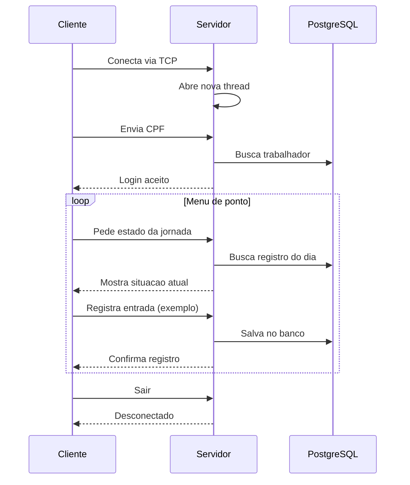

# Gestão de Frequências — Canteiro de Obras

**Disciplina:** AD44S — Aplicações Distribuídas e Concorrentes  
**Acadêmico:** Matheus C. P. Santos — RA 2609380  
**UTFPR** Campus Pato Branco — Trabalho III (Sockets TCP)

Sistema para **controlar a frequência dos trabalhadores em canteiros de obras**. Um **computador central** guarda todos os dados no banco PostgreSQL. Os **terminais nos canteiros** se conectam a ele pela rede usando **TCP** para bater ponto.

## Como o sistema funciona

```
┌─────────────────────────────┐      TCP :8080       ┌──────────────────────────────┐
│  TerminalCanteiroClienteTCP │ ◄──────────────────► │     ServidorCentralTCP       │
│   (computador do canteiro)  │                      │   (computador do servidor)   │
└─────────────────────────────┘                      └──────────────┬───────────────┘
                                                                    ▼
                                                       PostgreSQL (trabalho_decente)
```

| Computador | O que faz |
|------------|-----------|
| Servidor | Valida o CPF, registra o ponto, salva no banco e roda o painel de gestão |
| Terminal do canteiro | Tela para o trabalhador bater ponto; o admin pode abrir o menu completo (opção 7) |

**Tecnologias:** Java 21, Sockets TCP, JPA/Hibernate, PostgreSQL, Maven

## Por que usamos TCP?

O registro de ponto precisa **chegar inteiro e na ordem certa**. O TCP garante isso; o UDP não.

- Depois do login com CPF, cliente e servidor ficam **conectados o tempo todo**
- Cada ação do menu **envia um pedido e espera a resposta** do servidor
- Vários terminais podem usar o sistema **ao mesmo tempo** (cada um em sua thread)
- O painel de gestão do admin troca muitas mensagens pela mesma conexão

O UDP serviria para coisas que podem perder dados sem problema (ex.: leitura de um sensor). Para ponto e folha de frequência, TCP é o certo.

## Principais classes

| Classe | O que faz |
|--------|-----------|
| `ServidorCentralTCP` | Fica escutando na porta 8080, recebe pedidos e grava no banco |
| `TerminalCanteiroClienteTCP` | Programa do canteiro — conecta, faz login e mostra o menu |
| `NetworkConfig` | Configura IP, porta e mostra os IPs do servidor na tela |
| `GestaoRemotaSession` | Permite usar o painel admin no canteiro, mas o processamento fica no servidor |
| `PopularBancoDados` | Cria dados de teste no banco |

## Threads (execução em paralelo)

| Onde | Para quê |
|------|----------|
| `ServidorCentralTCP` | Cada terminal conectado ganha sua própria thread |
| `GestaoRemotaSession` | Uma thread lê o que o servidor manda enquanto o usuário digita |
| `ProcessadorFolhaPagamento` | Divide o cálculo da folha entre várias threads (menu admin → Análise de Desempenho) |

**No servidor:** quando um canteiro conecta, abre-se uma thread só para ele. Dois trabalhadores podem bater ponto ao mesmo tempo sem um travar o outro.

**No banco:** como várias threads gravam juntas, o `JPAUtil` usa `synchronized` para que duas threads não abram conexão com o banco ao mesmo tempo e gerem erro.

## Como rodar

```text
1. PopularBancoDados          # só na primeira vez
2. ServidorCentralTCP         # no PC servidor (anote o IP que aparecer)
3. TerminalCanteiroClienteTCP 192.168.x.x 8080   # no PC do canteiro
```

> Entre dois computadores, use o IP da rede (tipo `192.168.1.10`), não `127.0.0.1`. Libere a porta **8080** no firewall.

| Perfil | CPF | Observação |
|--------|-----|------------|
| Administrador | `11111111111` | Tem a opção 7 — Painel de Gestão |
| CLT | `22222222222` | Só bate ponto |
| Estagiário | `44444444444` | Só bate ponto |

## O que acontece na comunicação



### Passo a passo

| # | O que acontece |
|---|----------------|
| 1 | Servidor liga na porta 8080, mostra os IPs e fica esperando conexão |
| 2 | Terminal conecta ao servidor pela rede |
| 3 | Terminal envia o CPF → servidor confere no banco |
| 4 | Servidor informa o estado da jornada → terminal monta o menu |
| 5 | Trabalhador escolhe uma opção → servidor grava e confirma |
| 6 | Ao sair, a conexão é encerrada |

### Mensagens trocadas (uma por linha)

| Tipo | Exemplo |
|------|---------|
| Login | `AUTH:22222222222` |
| Comando | `CMD:PONTO_ENTRADA` |
| Login OK | `AUTH_SUCCESS;OPERACIONAL;João...` |
| Confirmação | `RESULTADO;Entrada registrada as 08:00` |

## Trechos importantes do código

**Servidor atende cada terminal em paralelo** (`ServidorCentralTCP.java`):

```java
while (true) {
    // Fica parado aqui até algum terminal do canteiro tentar conectar
    Socket clientSocket = serverSocket.accept();

    // Cria uma thread só para esse cliente — assim outro terminal
    // pode conectar sem ficar esperando o primeiro terminar de bater ponto
    new Thread(() -> processarRequisicao(clientSocket)).start();
}
```

**Terminal conecta e faz login** (`TerminalCanteiroClienteTCP.java`):

```java
// Abre a conexão TCP com o servidor central (handshake pela rede)
Socket socket = new Socket(ipServidor, portaServidor);

// Envia o CPF para o servidor validar no banco de dados
out.println("AUTH:" + cpf);

// Fica aguardando a resposta: AUTH_SUCCESS (liberado) ou AUTH_FAILED (negado)
String respostaAuth = in.readLine();
```

**Servidor separa login de comandos** (`ServidorCentralTCP.java`):

```java
// Lê mensagens do terminal, uma linha por vez, enquanto a conexão estiver aberta
while ((mensagem = in.readLine()) != null) {

    // Primeiro passo: autenticação — busca o CPF no PostgreSQL
    if (mensagem.startsWith("AUTH:")) { /* valida CPF e guarda na sessão */ }

    // Depois do login: comandos de ponto, ficha, gestão etc.
    // Só aceita CMD se o usuário já tiver se autenticado (cpfAutenticado != null)
    else if (mensagem.startsWith("CMD:")) { /* grava no banco e devolve RESULTADO */ }
}
```

**IP do servidor** — ao ligar, o servidor lista os IPs do PC (ex.: `192.168.1.10`) para o operador digitar no terminal do canteiro.

**Gestão remota (opção 7)** — o menu admin roda no servidor (onde está o banco). O terminal do canteiro só mostra a tela e envia o que o usuário digita.

---

*UTFPR — Campus Pato Branco — AD44S — 2026*
