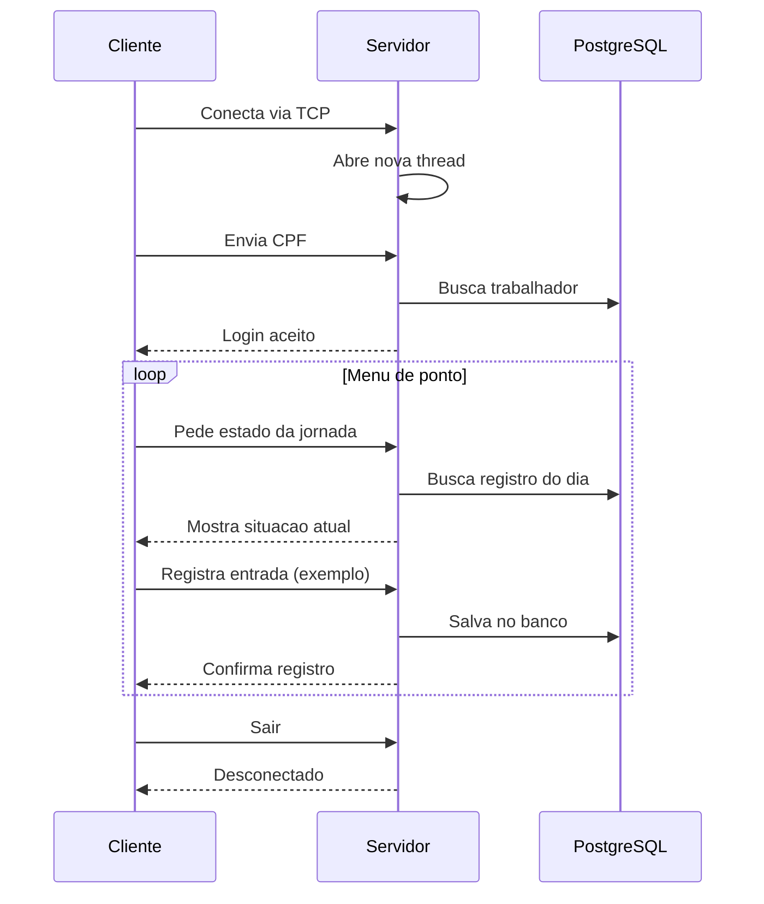

# Gestão de Frequências — Canteiro de Obras

**Disciplina:** AD44S — Aplicações Distribuídas e Concorrentes  
**Acadêmico:** Matheus C. P. Santos — RA 2609380  
**UTFPR** Campus Pato Branco — Trabalho III (Sockets TCP)

---

## 1. Sobre o projeto

Sistema para **controlar a frequência dos trabalhadores em canteiros de obras**, alinhado ao ODS 8 (Trabalho Decente).

- **Servidor central** — concentra o banco PostgreSQL e processa tudo
- **Terminais nos canteiros** — interface para bater ponto pela rede
- **Comunicação** — Sockets TCP na porta 8080

---

## 2. Arquitetura

```
┌─────────────────────────────┐      TCP :8080       ┌──────────────────────────────┐
│  TerminalCanteiroClienteTCP │ ◄──────────────────► │     ServidorCentralTCP       │
│   (computador do canteiro)  │                      │   (computador do servidor)   │
└─────────────────────────────┘                      └──────────────┬───────────────┘
                                                                    ▼
                                                       PostgreSQL (trabalho_decente)
```

| Computador | Papel |
|------------|-------|
| Servidor central | Valida CPF, registra ponto, salva no banco, painel de gestão |
| Terminal do canteiro | Tela de ponto; admin acessa menu completo (opção 7) |

**Quem conecta em quem?**

O trabalhador usa o **PC do canteiro** (cliente), digita o CPF e escolhe as opções. Esse terminal **se conecta ao servidor central** — não o contrário.

```
Trabalhador → PC do canteiro → TCP → Servidor central → PostgreSQL
```

**Tecnologias:** Java 21 · Sockets TCP · JPA/Hibernate · PostgreSQL · Maven

---

## 3. Por que TCP?

O registro de ponto precisa **chegar inteiro e na ordem certa**. TCP garante isso; UDP não.

- Cliente e servidor ficam **conectados** durante toda a sessão
- Cada ação envia um **pedido e espera resposta** (`RESULTADO`, `FIM_FICHA`)
- Vários terminais usam o sistema **ao mesmo tempo** (uma thread por conexão)
- UDP serviria para dados que podem se perder (ex.: sensor); **não para folha de ponto**

---

## 4. Principais classes

| Classe | O que faz |
|--------|-----------|
| `ServidorCentralTCP` | Escuta na porta 8080, processa comandos, grava no banco |
| `TerminalCanteiroClienteTCP` | Conecta ao servidor, faz login e exibe o menu |
| `NetworkConfig` | IP, porta e listagem dos IPs do servidor |
| `GestaoRemotaSession` | Painel admin no canteiro, processamento no servidor |
| `PopularBancoDados` | Cria dados de demonstração |

---

## 5. Threads

Cada **terminal conectado** ganha uma **thread** no servidor.

| Onde | Para quê |
|------|----------|
| `ServidorCentralTCP` | Uma thread por conexão TCP — terminais em paralelo |
| `GestaoRemotaSession` | Thread lê saída do servidor enquanto o usuário digita |
| `ProcessadorFolhaPagamento` | Cálculo paralelo da folha (menu admin → Análise de Desempenho) |

**Regra:** thread = conexão do terminal. Se cada canteiro tem 1 PC ligado, cada canteiro usa 1 thread.

**Exemplo — 3 funcionários, 3 PCs, mesmo canteiro:**

```
ServidorCentralTCP
├── Thread 1 → João  (CPF 22222222222)
├── Thread 2 → Lucas (CPF 44444444444)
└── Thread 3 → Maria (outro CPF)
```

Cada um faz login e bate ponto **em paralelo**, sem misturar registros. No **mesmo PC**, um usa por vez — sai (opção 6), o próximo conecta.

**No banco:** o `JPAUtil` usa `synchronized` para evitar conflito quando várias threads gravam juntas.

---

## 6. Demonstração — como rodar

```text
1. PopularBancoDados          # primeira vez
2. ServidorCentralTCP         # PC servidor — anote o IP exibido
3. TerminalCanteiroClienteTCP 192.168.x.x 8080   # PC do canteiro
```

> Use IP da rede local (`192.168.x.x`), não `127.0.0.1`, entre PCs diferentes. Libere a porta **8080** no firewall.

| Perfil | CPF | Observação |
|--------|-----|------------|
| Administrador | `11111111111` | Opção 7 — Painel de Gestão |
| CLT | `22222222222` | Registro de ponto |
| Estagiário | `44444444444` | Registro de ponto |

---

## 7. Fluxo da comunicação



| # | Etapa |
|---|-------|
| 1 | Servidor liga na porta 8080 e aguarda conexão |
| 2 | Terminal conecta → servidor abre uma thread |
| 3 | Terminal envia CPF → servidor valida no banco |
| 4 | Terminal pede estado → servidor monta o menu |
| 5 | Trabalhador escolhe opção → servidor grava e confirma |
| 6 | Opção Sair → conexão encerra |

### Mensagens (uma linha por vez)

| Tipo | Exemplo |
|------|---------|
| Login | `AUTH:22222222222` |
| Comando | `CMD:PONTO_ENTRADA` |
| Login OK | `AUTH_SUCCESS;OPERACIONAL;João...` |
| Confirmação | `RESULTADO;Entrada registrada as 08:00` |

---

## 8. Código principal

**Servidor — uma thread por terminal** (`ServidorCentralTCP.java`):

```java
while (true) {
    // Fica parado até algum terminal do canteiro conectar
    Socket clientSocket = serverSocket.accept();

    // Thread só para esse cliente — outro terminal não precisa esperar
    new Thread(() -> processarRequisicao(clientSocket)).start();
}
```

**Terminal — conexão e login** (`TerminalCanteiroClienteTCP.java`):

```java
// Abre conexão TCP com o servidor central
Socket socket = new Socket(ipServidor, portaServidor);

// Envia CPF para validação no banco
out.println("AUTH:" + cpf);

// Aguarda: AUTH_SUCCESS (liberado) ou AUTH_FAILED (negado)
String respostaAuth = in.readLine();
```

**Servidor — login antes dos comandos** (`ServidorCentralTCP.java`):

```java
while ((mensagem = in.readLine()) != null) {
    // Autenticação — busca CPF no PostgreSQL
    if (mensagem.startsWith("AUTH:")) { /* valida e guarda na sessão */ }

    // Comandos de ponto — só após login (cpfAutenticado != null)
    else if (mensagem.startsWith("CMD:")) { /* grava no banco e devolve RESULTADO */ }
}
```

**IP do servidor** — ao ligar, lista os IPs do PC (ex.: `192.168.1.10`) para digitar no terminal do canteiro.

**Gestão remota (opção 7)** — menu admin roda no servidor; o terminal só exibe a tela e envia o que o usuário digita.

---

*UTFPR — Campus Pato Branco — AD44S — 2026*
